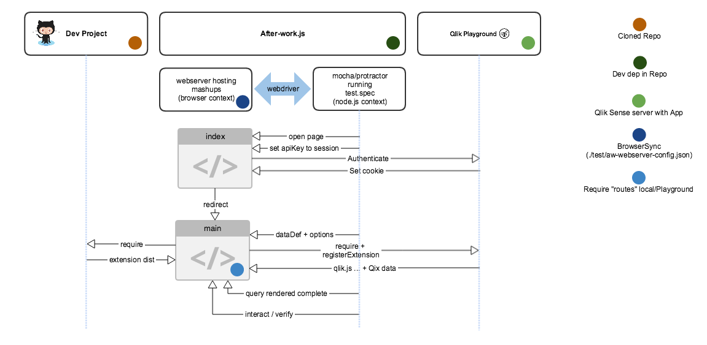

## Introduction

Integration testing of Qlik Sense visualization extensions can be performed using _Qlik Playground_ to minimize the setup for developing and testing your extensions.

This setup makes the tests run in two different contexts.
* The test itself runs in a Node.js environment together with a web-server hosting a mashup web page.
* The mashup web page is loaded into a web browser that loads resources from both _Qlik Playground_ (running a Qlik Sense installation) and from the local web server hosting the mashup, together with the source of the Qlik Sense visualization extension.

The communication between the node context and the web browser context is established using a web driver protocol which in this case is integrated in Protractor that is part of the **after-work.js** testing framework.

## Flowchart


## Integration setup
### Installing npm dependencies
 1. Add the following as dev dependencies to your **package.json**:
 ```
"extend": "^3.0.0"
"playground-js-api": "git+ssh@github.com:Qlik-Branch/playground-js-api.git"
"after-work.js": "^2.2.0"
"protractor": "^5.1.2"
```
* "extend": to be able to merge test configuration
* "playground-js-api": " enables you to connect to Qlik Playground with an `apiKey`
* "after-work.js": contains test environment
* "protractor": JS wrapper for automation web browser interactions

 2. Run the command: **npm install**

### Installing other dependencies
The test framework uses a chromeDriver to interact with the browser and this is not included the the npm packages.
```
"scripts": {
    "test:setup-webdriver": "node_modules/.bin/webdriver-manager update --standalone false"
```
The script target above installs the chromeDriver and needs to be to be run only once.

### Setting apiKey
The Qlik Playground `apiKey` must be set to an environment variable to avoid checking in, thus making the `apiKey` public.

\*nux
```
export apiKey=<your apiKey>
```
Windows
```
SET apiKey=<your apiKey>
```

### Test folder structure
Copy the test folder into your repository.

### Web server to host mashup/extension locally
1. Configure the web server:
 * after-work.js: contains a web server that is used to host the local files. Some configuration is needed to be able to server files from different part of the filesystem.
 * ./test/aw-webserver-config.json: add a route to the folder where the extension is built (for example "./build/" , "./dist/" or "/release") to allow the webserver to read your extension code from filesystem

2. Start the web server.
Add a script section in the package.json to start the web server with npm:
 ```
"scripts": {
     "test:aw-webserver": "aw-web-server -c ./test/aw-webserver-config.json"
}
 ```
You can now start the web server with: **npm run test:aw-webserver**

### Adjust the mashup script
1. Adjust the config on the top to include your `apiKey`:
 ```
var config={
	host:"playground.qlik.com",
	prefix:"/playground/",
	port:"443",
	isSecure:true,
	rejectUnauthorized:false,
	apiKey:sessionStorage.getItem( "apiKey" ),
	appname:"d7ad663d-2413-4088-a3c9-e5ed0283c788"
};
 ```
You can change the `appname` in the config to use other sorces of test data/apps.

2. RequireJS is used to resolve dependencies both from Qlik Playground(= Qlik Sense Server) and the local extension to be tested.
By default, RequireJS will try to fetch all dependencies from Qlik Playground but a `paths` statement can tell RequireJS that the extension code is fetched from the local web server.
 ```
paths: {
    "<scope>": "http://localhost:8000/<route from aw-webserver-config.json>/"
}
 ```

3. The "namespace" can now be used inside the main function to fetch the extension locally:
 ```
require(['<scope>/<extension filename>'], function( extension ) {
 ```

4. Register the extension to be used so that Qlik Playground (Qlik Sense Server) is aware of it:
 ```
qlik.registerExtension( "extension", extension );
 ```

5. Then you create the extension using the Visualization API:
 ```
app.visualization.create( "extension", ...
 ```

### Adding data to extension
To only require one mashup, the data definition (with additional options) is injected into the mashup from the testing framework.

1. This dataDef fetches the first 5 characters from the Walking Dead app and counts the kills per character:
 ```
const dataDef = [{ qDef: { qFieldDefs: ['Characters']},
qOtherTotalSpec: {qOtherMode: 'OTHER_COUNTED', qOtherCounted: '5', qSuppressOther: true}
},
'=Count([Kills])'];
 ```

2. Inject the data:
 ```
browser.executeScript( "main(arguments)", JSON.stringify(dataDef) );
 ```

### Wait until the extension is rendered

1. The `app.visualization.create` method has a callback that triggers `onRendered` that is used to set a class on the object and let the test framework wait until the class is added:
 ```
onRendered: function(){
	document.getElementById("extension").classList.add( "rendered" );
}
 ```
The callback is only executed once.

### Interaction and verifications
The extension is now rendered and you can interact with it using protractor
